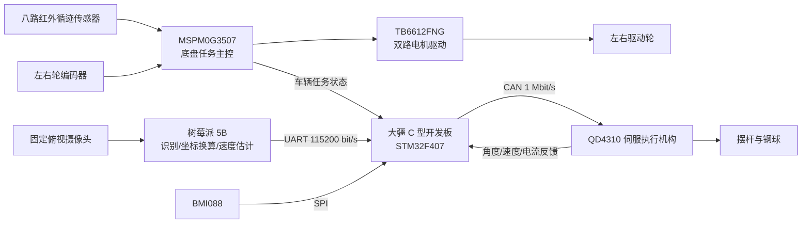
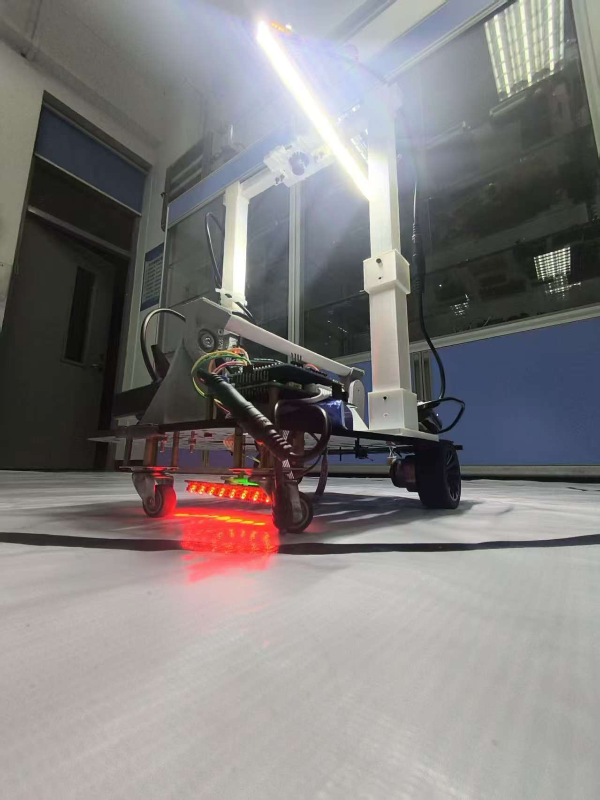

# 2026 全国大学生电子设计竞赛 H 题省一等奖作品——车载平衡滚球运动控制系统

> 华南理工大学（五山校区）｜本科组｜H 题

本项目面向 2026 年全国大学生电子设计竞赛 H 题“车载平衡滚球运动控制系统”。装置由自动循迹小车、带凹槽摆杆、钢球、摆杆执行机构、车载视觉模块和计时显示模块组成，采用“底盘任务主控、球杆专用控制、车载视觉测量”的分层架构，完成黑色环形轨迹循迹、钢球位置检测、静止与运动状态下的滚球控制、图像显示与录像，以及异常状态保护。

## 项目任务

系统围绕“移动载体上的滚球稳定与定位”展开，主要任务包括：

1. 小车沿黑色环形轨迹稳定行驶，在规定时间内完成一圈并返回起点停车。
2. 小车静止时，使钢球按 `O 点 → +5 cm → -5 cm` 的顺序快速移动并稳定。
3. 小车由 A 点驶向 B 点以及绕行整圈时，使钢球保持在中心或给定位置附近。
4. 实现实时图像显示、录像回放、比赛计时、状态提示和故障保护。

报告将球位置最大允许误差设定为 **1 cm**，并以 **0.6～0.8 cm** 作为实验室调试目标。以上数值属于设计与调试指标，实际表现会受到机械装配、视觉标定、赛道、光照和控制参数的共同影响。

## 系统总体方案



三个控制平台各自承担最适合的任务：

- **MSPM0G3507**：负责红外循迹、编码器测速、左右轮速度闭环、比赛计时、模式切换与停车管理。
- **树莓派 5B**：通过固定俯视摄像头完成钢球识别、位置换算、速度估计、图像传输与录像。
- **大疆 C 型开发板**：构建钢球位置外环和摆杆伺服内环，融合车辆任务状态与 BMI088 加速度信息，并通过 CAN 控制 QD4310。

控制数据采用有线链路传输；无线链路仅用于视频显示与回放，不参与实时闭环，避免网络抖动影响控制稳定性。

## 核心子系统

### 1. 自动循迹底盘

底盘使用八路红外传感器检测黑色轨迹，根据各通道相对车体中心的位置进行加权，得到横向循迹偏差。MSPM0G3507 根据偏差计算左右轮差速目标，并结合编码器反馈进行速度 PID 调节，最终通过 TB6612FNG 输出电机 PWM。

- 循迹与速度控制周期：`10 ms`（`100 Hz`）。
- 正常循迹时采用加权偏差与差速控制。
- 轨迹暂时丢失时，根据上一时刻偏差方向进行受限搜索。
- 超过规定时间仍未重新捕获轨迹时停车，避免车辆失控。
- 主循环负责按键、模式切换和 OLED 显示，状态机统一管理启动、运行与停车。

左右轮目标速度可概括为：

```text
vL* = v0 - Kt × eL
vR* = v0 + Kt × eL
```

其中 `v0` 为基础线速度，`eL` 为循迹横向偏差，`Kt` 为转向修正系数。

### 2. 钢球视觉测量

摄像头固定在摆杆上方，树莓派 5B 对图像进行去畸变、滤波、圆心定位和状态估计。视觉算法利用每帧检测到的摆杆两端标记更新球道轴线，再将钢球圆心投影到轴线上并换算为相对中心 O 点的实际位置，从而减小车体振动、摆杆转动和固定像素映射误差的影响。

钢球速度使用相邻有效帧的真实时间间隔计算，并进行低通处理；控制数据通过有线 UART 发送至 C 板。通信数据包含序号、时间戳和 CRC 校验信息，以便识别重复帧、过期数据和传输错误。

### 3. 球位置串级闭环

滚球控制采用“外慢内快”的串级结构：

- **位置外环**：输入目标位置与钢球实际位置，位置误差产生纠偏角度，钢球速度反馈提供阻尼，减少往返振荡。
- **摆杆内环**：利用 QD4310 返回的实际角度、角速度和电流信息，快速跟踪目标摆杆角度。
- **任务前馈**：根据底盘启动、加速、转弯和制动状态提前补偿可预知扰动。
- **加速度前馈**：使用 BMI088 测得的车体纵向加速度补偿车辆运动带来的快速扰动。

外环控制关系可概括为：

```text
θfb  = Kpx × (xref - x) - Kdx × v
θref = sat(θfb + θtask_ff + θaccel_ff)
```

其中 `sat` 表示对摆杆角度、角速度和变化率进行限制。任务前馈与加速度前馈只负责扰动补偿，不能替代视觉位置反馈；当前馈数据异常时，应在有限时间内平滑衰减为零。

### 4. 通信与安全保护

| 链路 | 接口 | 用途 |
|---|---|---|
| 树莓派 5B → C 板 | UART，115200 bit/s | 钢球位置、速度及置信度信息 |
| MSPM0G3507 → C 板 | UART | 启动、加速、转弯、制动等车辆任务状态 |
| C 板 ↔ QD4310 | CAN，1 Mbit/s | 控制命令以及角度、速度、电流反馈 |
| BMI088 → C 板 | SPI | 车辆纵向加速度与惯性信息 |

系统设置了多层异常处理：

- 视觉数据过期、失联或置信度不足时限制输出并进入恢复状态。
- UART 超时、CRC 错误或数据序号异常时拒绝使用无效数据。
- CAN 反馈异常、电机电流异常或执行机构失联时关闭输出。
- 钢球越界、控制量饱和或机械角度接近限位时执行限幅或停车。
- 底盘长时间丢线时停止运行，防止脱离赛道。

## 硬件组成

| 模块 | 主要器件 | 作用 |
|---|---|---|
| 底盘主控 | MSPM0G3507，最高主频 48 MHz | 循迹、轮速闭环、计时与任务状态机 |
| 底盘驱动 | TB6612FNG + 带编码器直流减速电机 | 双轮差速运动与速度反馈 |
| 轨迹检测 | 八路红外光电传感器 | 检测黑色环形轨迹及横向偏差 |
| 视觉平台 | 树莓派 5B + 固定俯视摄像头 | 钢球识别、坐标换算、速度估计和录像 |
| 球杆主控 | RoboMaster 开发板 C（STM32F407） | 串级控制、状态管理和通信 |
| 执行机构 | QD4310 | 驱动摆杆并反馈角度、速度和电流 |
| 惯性测量 | C 板板载 BMI088 | 获取车体加速度并提供前馈信息 |
| 人机交互 | 按键 + OLED | 模式选择、计时和状态显示 |

## 关键工程参数

以下参数来自设计报告中的当前工程配置，复现时应根据实际硬件重新核验：

| 参数 | 当前配置 |
|---|---:|
| 底盘控制周期 | 10 ms / 100 Hz |
| 球杆控制周期 | 5 ms / 200 Hz |
| 视觉至 C 板串口 | 115200 bit/s |
| QD4310 CAN 总线 | 1 Mbit/s |
| 摆杆水平参考角 | 1.2461 rad |
| 摆杆正常工作范围 | 1.10～1.40 rad |
| 电机电流限制 | 1.65 A |
| 电机速度限制 | 1000 r/min |
| 循迹黑线/白底阈值 | 800 / 1300（带滞回判断） |
| 速度 PID | Kp=2000，Ki=200，Kd=5 |
| PID 输出限幅 | ±8000 |

BMI088 在参与前馈前需要完成六面静态标定、坐标变换、零偏和比例校正、温漂检查、低通滤波以及姿态/重力处理。未完成标定时，惯性数据只用于观测，不直接参与控制。

## 运行模式与测试结果

设计报告给出的底盘代码设定与静态核验结果如下：

| 项目 | 模式 1 | 模式 2 | 模式 3 |
|---|---:|---:|---:|
| 目标速度 | 2.20 rps | 1.77 rps | 1.70 rps |
| 运行策略 | 直接启动 | 缓慢加速、匀速、减速 | 快速加速、匀速、减速 |
| 停车逻辑/时间 | 检测终点后延时 500 ms 停车 | 总时间约 28.6 s | 总时间约 9.0 s |

当前报告中的量化测试表主要验证了红外循迹、编码器测速、左右轮速度闭环、三种运行模式、PID 限幅和阈值滞回判断。滚球部分采用“视觉标定 → 静止球控 → 运动中居中 → 任意位置控制”的分阶段调试流程；球位置误差 `≤1 cm` 及实验室 `0.6～0.8 cm` 为设计与调试目标，不在此处扩写为未经报告数据支持的最终测量结论。

## 装置优势

1. **异构分层控制。** 底盘、视觉和滚球控制分别运行在 MSPM0G3507、树莓派 5B 和大疆 C 板上，实时电机控制与高负载图像处理互不抢占资源，单个模块异常也不必同时拖垮整套系统。
2. **控制链路与图传链路分离。** 钢球位置始终通过有线 UART 进入闭环，无线链路只承担显示和录像，兼顾可观测性与控制可靠性。
3. **视觉坐标对机械振动更鲁棒。** 每帧根据摆杆端点重新确定球道轴线，再计算钢球轴向坐标，相比固定像素标尺更能适应车辆振动和摆杆姿态变化。
4. **反馈与前馈协同。** 钢球位置外环保证稳态目标，摆杆快速内环提升响应，底盘任务前馈和 BMI088 加速度前馈共同抑制车辆加减速带来的扰动。
5. **安全边界完整。** 系统同时监测视觉、UART、CAN、电机反馈、钢球位置和控制饱和状态，并设置角度、电流、速度和变化率限制，便于在异常时降级或停车。
6. **模块化调试与故障隔离。** 底盘、视觉、执行机构和机械结构可以独立测试，适合按照由单模块到整机的顺序逐步联调，降低竞赛现场排错成本。
7. **机械结构便于迭代。** 龙门架为摄像头与上层执行机构提供清晰安装基准，仓库同时保留机械设计资料与 A1 mini 可打印 STL 文件，便于快速修改和复现。

## 仓库内容

本仓库按成员与模块保留了不同分支：

| 分支 | 主要内容 |
|---|---|
| [`Rolldish`](https://github.com/Rolldish/Electronics-competition-26/tree/Rolldish) | 小车底盘、灰度循迹、平衡车版本及龙门架 A1 mini 可打印 STL 文件 |
| [`happyr0okiie`](https://github.com/Rolldish/Electronics-competition-26/tree/happyr0okiie) | H 题视觉与控制、云台控制工程及机械结构设计资料 |
| [`meyumei`](https://github.com/Rolldish/Electronics-competition-26/tree/meyumei) | C 板控制工程、K230 视觉模块及小车相关程序 |

报告所述正式方案采用树莓派 5B 进行滚球视觉测量；仓库中的 K230 内容属于相关视觉工程与迭代资料，复现时请注意区分具体方案。

## 开发环境

| 模块 | 主要环境 |
|---|---|
| MSPM0G3507 底盘 | Code Composer Studio（CCS）+ SysConfig |
| 大疆 C 板控制 | CLion + STM32CubeMX + CMake |
| 树莓派视觉 | Raspberry Pi 5B + 摄像头图像处理环境 |
| K230 相关视觉资料 | CanMV K230 工具链 |
| 机械结构 | SolidWorks / STL 切片与 3D 打印工具 |

## 推荐复现与联调顺序

1. **机械装配**：检查摆杆、钢球轨道、执行机构、摄像头和龙门架的安装位置与机械限位。
2. **电气检查**：确认各模块电压、电流、极性和共地关系，单独验证电源稳定性。
3. **底盘测试**：架空车轮检查电机方向、PWM、编码器反馈和速度闭环，再进入赛道调试循迹。
4. **视觉标定**：完成相机去畸变、摆杆端点识别、像素坐标换算和真实时间戳速度估计。
5. **执行机构测试**：检查 QD4310 CAN 通信、角度反馈、方向、软限位、电流限制和急停逻辑。
6. **静止滚球控制**：先关闭底盘运动，依次调整位置比例、速度阻尼和必要的积分参数。
7. **运动中居中**：加入底盘任务状态和加速度前馈，从低速、低幅度开始逐步增加工况。
8. **整机测试**：完成 A 点到 B 点、整圈循迹、给定位置控制、录像和异常保护测试。

## 装置照片

<p align="center">
  
</p>

## 注意事项

- 本仓库是竞赛期间的工程归档，不同分支对应不同模块、成员和迭代版本。
- 报告中的阈值、PID、角度、电流与速度限制均与当时硬件相关，不能直接视为其他装置的通用参数。
- 首次运行应限制执行机构运动范围，并确保钢球、摆杆和龙门架周围没有人员或易损物品。
- 修改机械结构、相机位置或电机方向后，必须重新完成视觉坐标、零位、限位和控制方向校准。
- 建议先保存原始参数和可运行版本，再逐项调整，避免多个模块同时变化导致问题难以定位。
